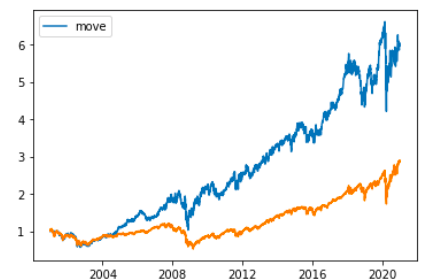

# NapTakLEE_Portfolio
NapTakLEE's Portfolio

## Project I: Monte Carlo Margin Maintance Calculation Using Microsoft Excel
- Finding accurate minimum margin deposit to maintance a cross hedging protfolio
- Key Topic: Monte Carlo Simulation, Mark On Market, Cross Hedging, Futures

## Project II: Hong Kong Housing price Regression Model using R (Group Project)
-
- Key Topic:  Regression Modeling
## Project III: Sector Rotation Streategy Backtest
- Inspired by John
- Rotation based on relative strength of SPDR ETF relative to SPY

